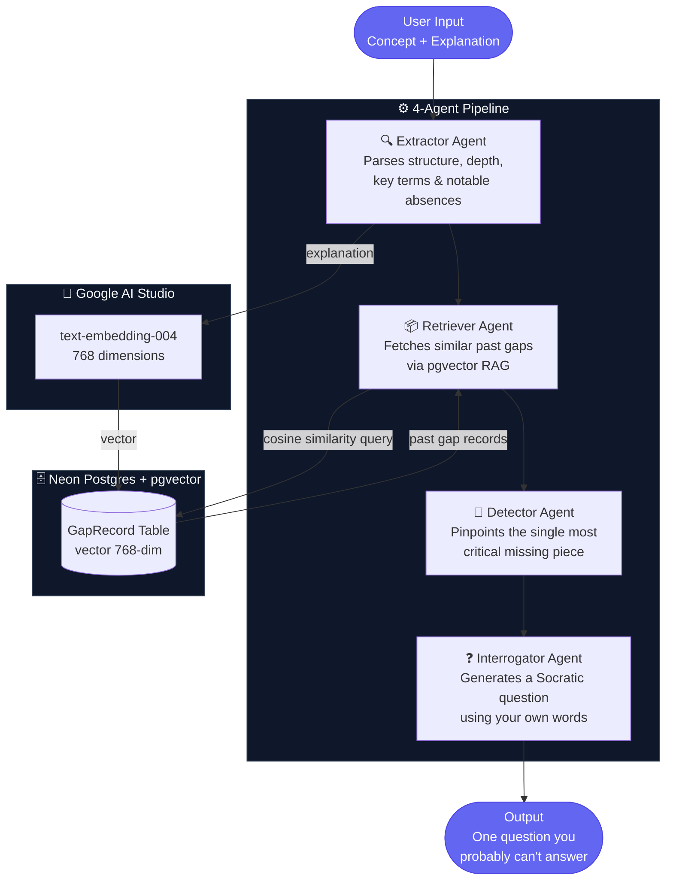

# Lacuna

> *You think you understand it. Lacuna finds exactly where you don't.*

Lacuna is a 4-agent AI pipeline that reads your explanation of any technical concept and generates a single Socratic question targeting the most critical gap in your understanding — using your own words against you.

**[→ Live Demo](https://lacuna.vercel.app)**

---

## The Problem

The gap between *"I understood the lecture"* and *"I actually understand this"* is invisible — until you're forced to explain it out loud. Most study tools test you with generic flashcards written by someone else. Lacuna responds to what *you specifically said*.

---

## Architecture



---

## Tech Stack

| Layer | Technology |
|---|---|
| **Framework** | Next.js 14 (App Router) |
| **Language** | TypeScript |
| **AI — LLM** | Claude Sonnet via [OpenRouter](https://openrouter.ai) |
| **AI — Embeddings** | Google AI Studio `text-embedding-004` (768-dim) |
| **Database** | [Neon](https://neon.tech) Postgres (serverless) |
| **Vector Search** | pgvector — cosine similarity |
| **ORM** | Prisma |
| **Tooling / Actions** | [Composio](https://composio.dev) |
| **Deployment** | Vercel |
| **CI/CD** | GitHub Actions + Vercel preview deployments |

---

## How It Works

1. **You explain** a concept in plain English — no prompts, no hints
2. **Extractor** parses your explanation: structure type, depth level, key terms used, and what's missing
3. **Retriever** queries your past gap records using pgvector cosine similarity — surfacing recurring blind spots
4. **Detector** cross-references the extractor output with retrieved history and identifies the *single most critical* gap
5. **Interrogator** crafts a Socratic question that quotes your own words and targets that exact gap
6. Every agent step **streams live** to the UI — you watch the pipeline run in real time

---

## Project Structure

```
lacuna/
├── src/
│   ├── agents/
│   │   ├── extractor.ts       # Parses explanation structure & gaps
│   │   ├── retriever.ts       # pgvector RAG — fetches past gaps
│   │   ├── detector.ts        # Identifies the critical missing piece
│   │   └── interrogator.ts    # Generates the Socratic question
│   ├── lib/
│   │   ├── db.ts              # Prisma client
│   │   └── embeddings.ts      # Google AI Studio embeddings + gap saving
│   └── app/
│       └── api/
│           └── analyze/
│               └── route.ts   # Streaming API route (runs full pipeline)
├── prisma/
│   └── schema.prisma
├── .github/
│   └── workflows/
│       └── ci.yml
└── .env.local
```

---

## Getting Started

### Prerequisites

| Service | Where to get it |
|---|---|
| **OpenRouter** | [openrouter.ai](https://openrouter.ai) → API Keys |
| **Google AI Studio** | [aistudio.google.com](https://aistudio.google.com) → Get API Key |
| **Composio** | [app.composio.dev](https://app.composio.dev) → Settings → API Key |
| **Neon** | [neon.tech](https://neon.tech) → Free tier is enough |

### Installation

```bash
# 1. Clone the repo
git clone https://github.com/yourusername/lacuna.git
cd lacuna

# 2. Install dependencies
npm install

# 3. Set up environment variables
cp .env.example .env.local
```

### Environment Variables

```env
OPENROUTER_API_KEY=your-openrouter-key-here
GOOGLE_AI_STUDIO_API_KEY=your-google-ai-studio-key-here
COMPOSIO_API_KEY=your-composio-key-here
DATABASE_URL=your-neon-pooled-connection-string
DIRECT_URL=your-neon-direct-connection-string
```

### Database Setup

```bash
# 4. Enable pgvector on your Neon database
# Run this once in your Neon SQL editor:
# CREATE EXTENSION IF NOT EXISTS vector;

# 5. Push Prisma schema
npx prisma db push

# 6. Generate Prisma client
npx prisma generate
```

### Run Locally

```bash
npm run dev
```

Open [http://localhost:3000](http://localhost:3000)

---

## CI/CD

Every push triggers a GitHub Actions workflow that runs lint + build checks before Vercel deploys. Pull requests automatically get a Vercel preview URL.

```
Push / PR
   ↓
GitHub Actions — lint + build
   ↓
Pass → Vercel deploys preview URL
   ↓
Merge to main → Vercel deploys to production
```

---

## What's Next

- **Per-concept embeddings** — currently embeds the full explanation as one vector; splitting by concept would let the system detect patterns like *"you always skip the mechanism, never just the definition"* across different topics
- **Spaced repetition loop** — resurface your hardest questions 24 hours later
- **Session history view** — see all your gaps across topics over time

---

## License

MIT
